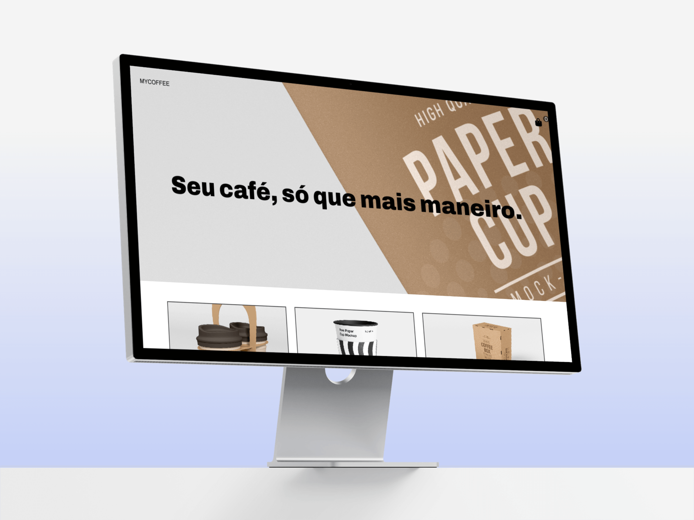

# My Coffee :coffee:	

<h3>Vue Project :rocket:	</h3>

My Coffee is a project of a fake virtual shop with a cart system.

The project have a minimalistic design and a responsive layout.

<a href="https://mycoffee-nu.vercel.app/">Visit the site!</a>
 

### 🛠 Technologies

The following technologies was used to build the project:

- [Vue](https://vuejs.org/)
- [Vue-Router](https://router.vuejs.org/)
- [Vuex](https://vuex.vuejs.org/)
 

### Features

- [x] Cart
- [x] Modals
- [x] Products cards
- [ ] Back-end

 

### Author
---

 
  
 <b>Leonardo Nicola</b></a> 🚀

Made with ❤️ by Leonardo Nicola 👋🏽 Contact me!

 

